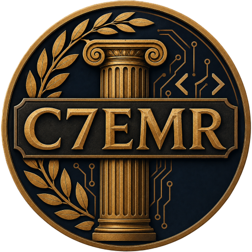

  

# Civilization 7 Extended Modding Runtime (C7EMR)

**C7EMR** is a series of Sid Meier's Civilization 7 mods that enhance the modding runtime to allow modders to write in different languages other than JavaScript.

## Mods

- [x] [**c7emr-wasm**](packages/wasm/README.md) - for developing in compiled languages such as Rust or C++. Confirmed working end-to-end for Rust; see its README for current status and caveats.
- [ ] [**c7emr-lua**](packages/lua/README.md) (**currently work in progress**) - for developing in Lua
- [ ] [**c7emr-python**](packages/python/README.md) (**currently work in progress**) - for developing in Python
