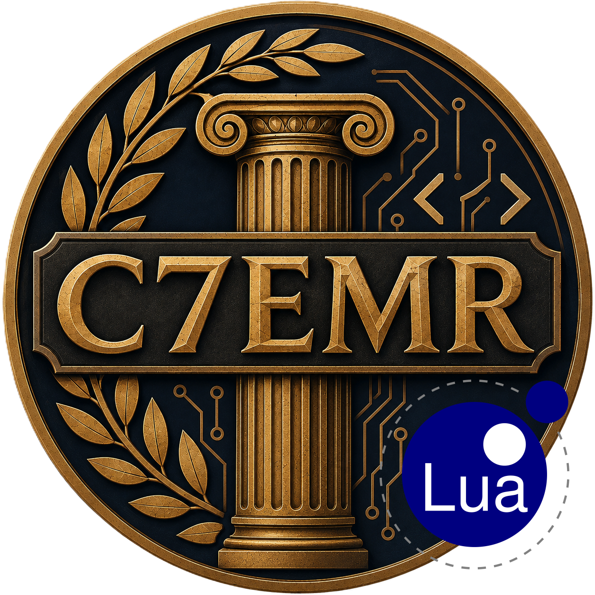

  

# C7EMR - Lua

**C7EMR - Lua** is the Lua mod for [C7EMR](../../README.md). It lets you write Civilization 7 mods in Lua instead of JavaScript, running on [Fengari](https://fengari.io/), a Lua 5.3 VM written in pure JS.

## Status

- ✅ Loading and running `.lua` files from your mod's own files - confirmed working end-to-end.
- ⚠️ Calling from Lua back into JS (`js.global.foo.bar(...)`) via [fengari-interop](https://github.com/fengari-lua/fengari-interop) - the bridge is wired up and open by default, but argument passing on dotted (`.`) calls hasn't been fully verified. Prefer `:` method-call syntax when calling into JS objects until this is confirmed.

## Why this mod exists

Fengari is a full reimplementation of the Lua VM in ES6, not WebAssembly, so - unlike [C7EMR - WASM](../wasm/README.md) - there's no separate binary to fetch and instantiate at runtime, and none of Coherent GT's missing `WebAssembly`/`TextEncoder`/`crypto` APIs come into play. This mod just bundles Fengari directly into its own script and exposes a small loader on top of it.

## Using this mod from your own mod

1. Write your mod logic in one or more `.lua` files.
2. Declare them as `<ImportFiles>` in your `.modinfo` (not `<UIScripts>` - see below for why).
3. Write a small JS entry script that loads your main `.lua` file once this mod's loader is ready.

See the [Lua guide](docs/lua.md) for the full walkthrough.

## Steam Workshop

<!-- TODO: link to the published Steam Workshop page -->
