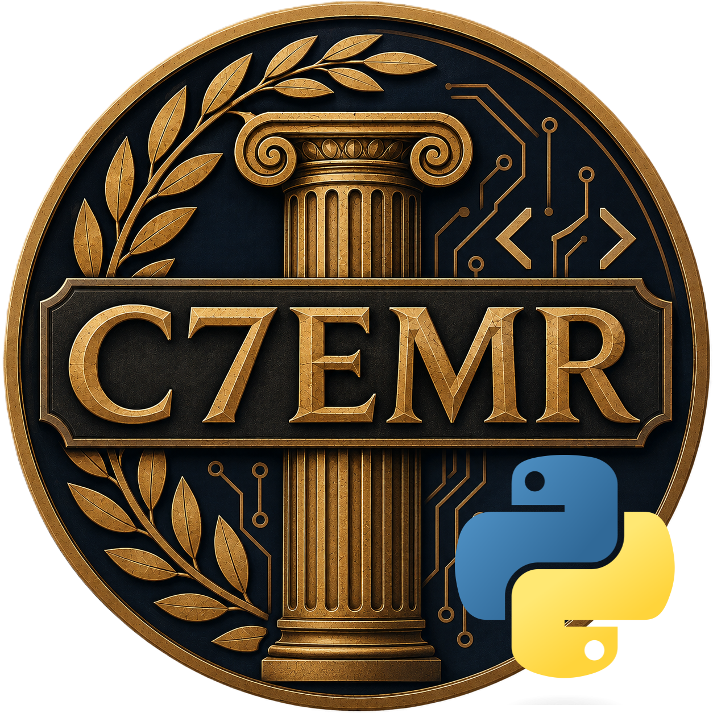

  

# C7EMR - Python

**C7EMR - Python** is the Python mod for [C7EMR](../../README.md). It lets you write Civilization 7 mods in Python instead of JavaScript, running on [Brython](https://brython.info/), a Python 3 implementation that compiles Python to JS in the browser.

## Status

- ✅ Loading and running `.py` files from your mod's own files - confirmed working end-to-end, including the standard library (`brython_stdlib.js`) and Python-level tracebacks on error.
- ⚠️ Rejected `C7EMR.loadPython` promises carry only a best-effort one-line error summary, not a full traceback - Brython prints the full traceback to the console itself before the promise rejects, so check there for details.

## Why this mod exists, and why it's shaped differently from C7EMR - WASM/Lua

Brython, unlike Fengari, can't be bundled through this repo's normal rollup/commonjs pipeline. It compiles Python to JS at runtime using `eval()`/`new Function()`, and that generated code expects to resolve Brython's own internals through the *global* scope - something that only holds if `brython.js` runs as a genuine, top-level classic script, not wrapped inside rollup's commonjs module shim. (Confirmed by testing: bundling it throws `$B is not defined` from inside Brython's own parser codegen the moment you try to run any Python.)

So this mod ships `brython.js` and `brython_stdlib.js` unmodified, and loads them at runtime via a real `<script src>` tag - the same technique [C7EMR - WASM's Go guide](../wasm/docs/go.md) uses for `wasm_exec.js`, for the same underlying reason (some runtimes assume they own the global scope).

## Using this mod from your own mod

1. Write your mod logic in one or more `.py` files.
2. Declare them as `<ImportFiles>` in your `.modinfo` (not `<UIScripts>`).
3. Write a small JS entry script that loads your main `.py` file once this mod's loader is ready.

See the [Python guide](docs/python.md) for the full walkthrough.

## Steam Workshop

<!-- TODO: link to the published Steam Workshop page -->
