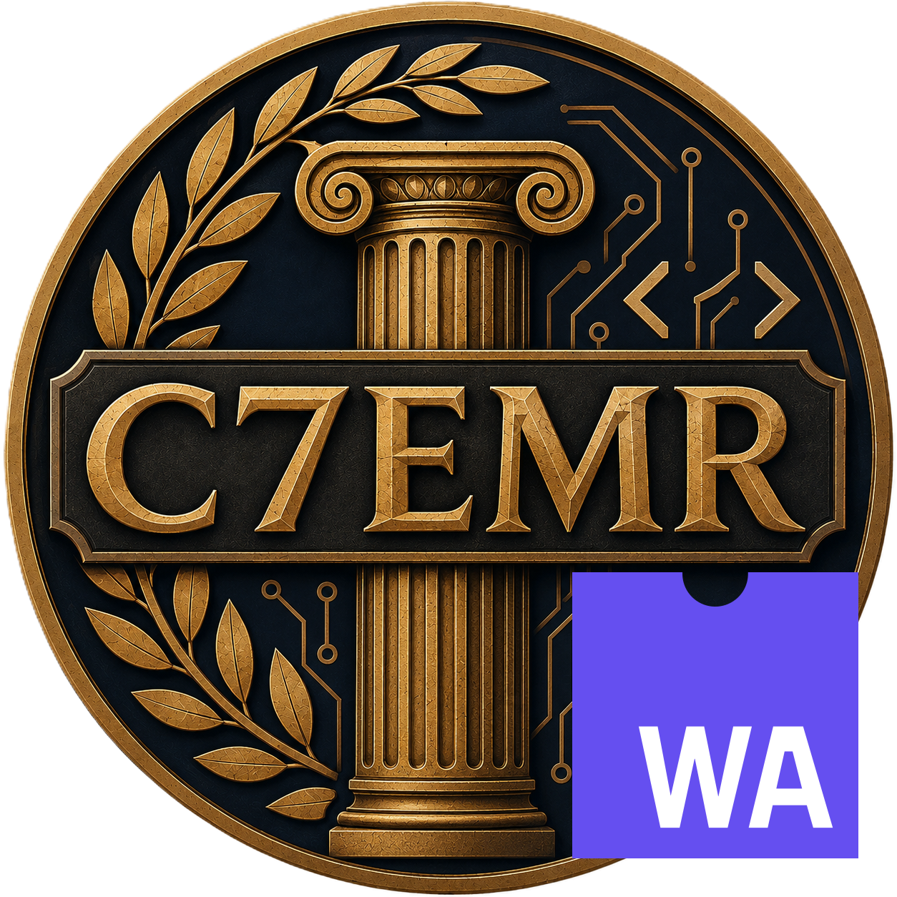

  

# C7EMR - WASM

**C7EMR - WASM** is the WebAssembly (WASM) mod for [C7EMR](../../README.md). It lets you write Civilization 7 mods in any language that compiles to WebAssembly, instead of JavaScript.

## Status

- ✅ **Rust** (via [wasm-bindgen](https://wasm-bindgen.github.io/wasm-bindgen/)) - confirmed working end-to-end.
- ⚠️ **Go** (its standard `js/wasm` target) - plain computation works, but calling into JavaScript (`syscall/js`) panics, likely due to a polywasm bug. See the [Go guide](docs/go.md) for details.
- Other toolchains (C/C++ via Emscripten, C#, AssemblyScript, etc.) - untested. Should work if they stick to standard WebAssembly and don't lean on APIs beyond what's listed below, but that's not guaranteed.

## Why this mod exists

Civilization 7's scripting environment (Coherent GT) has no native `WebAssembly` implementation at all. This mod supplies one via [polywasm](https://github.com/evanw/polywasm), a pure-JS WebAssembly interpreter.

Coherent is also missing several other Web APIs that popular WASM toolchains assume exist. So far, two have been polyfilled in this mod:

- `TextEncoder`/`TextDecoder` - used by wasm-bindgen, Go's `wasm_exec.js`, and most other toolchains to marshal strings across the JS/WASM boundary.
- `crypto.getRandomValues` - used for seeding randomness (Go's runtime requires it unconditionally; Rust's `getrandom`/`rand` crates commonly need it too).

This isn't necessarily a complete list. If your language/toolchain assumes some other browser API exists (and Coherent doesn't have it), you may need to supply your own polyfill for it - this mod can only cover what I've actually run into, not every API a WASM toolchain might assume. If you find one that's missing, please open an [issue](https://github.com/dmanuel64/c7emr/issues) or [PR](https://github.com/dmanuel64/c7emr/pulls).

## Using this mod from your own mod

The general shape is the same regardless of language:

1. Compile to WebAssembly
2. Declare the output as `<ImportFiles>` in your `.modinfo` (not `<UIScripts>` - see the guides below for why)
3. Write a small entry script that loads it once this mod's polyfills are ready.

### Per-language guides

- [Rust](docs/rust.md) - confirmed working end-to-end.
- [Go](docs/go.md) - partially working; read the known issue before relying on it.

## Steam Workshop

- <https://steamcommunity.com/sharedfiles/filedetails/?id=3774624010>
